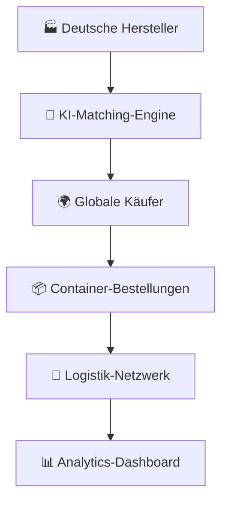
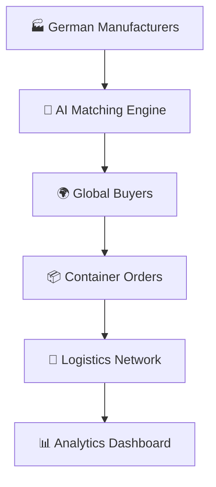

# 🇩🇪 MADE-IN-GERMANY-INTERNATIONAL- Initiator & Gründer: <br> Andreas Thommen (Geboren 1972 in der Hansestadt Bremen) 

<div align="center">

```ascii
███╗   ███╗ █████╗ ██████╗ ███████╗    ██╗███╗   ██╗     ██████╗ ███████╗██████╗ ███╗   ███╗ █████╗ ███╗   ██╗██╗   ██╗
████╗ ████║██╔══██╗██╔══██╗██╔════╝    ██║████╗  ██║    ██╔════╝ ██╔════╝██╔══██╗████╗ ████║██╔══██╗████╗  ██║╚██╗ ██╔╝
██╔████╔██║███████║██║  ██║█████╗      ██║██╔██╗ ██║    ██║  ███╗█████╗  ██████╔╝██╔████╔██║███████║██╔██╗ ██║ ╚████╔╝ 
██║╚██╔╝██║██╔══██║██║  ██║██╔══╝      ██║██║╚██╗██║    ██║   ██║██╔══╝  ██╔══██╗██║╚██╔╝██║██╔══██║██║╚██╗██║  ╚██╔╝  
██║ ╚═╝ ██║██║  ██║██████╔╝███████╗    ██║██║ ╚████║    ╚██████╔╝███████╗██║  ██║██║ ╚═╝ ██║██║  ██║██║ ╚████║   ██║   
╚═╝     ╚═╝╚═╝  ╚═╝╚═════╝ ╚══════╝    ╚═╝╚═╝  ╚═══╝     ╚═════╝ ╚══════╝╚═╝  ╚═╝╚═╝     ╚═╝╚═╝  ╚═╝╚═╝  ╚═══╝   ╚═╝   
```


[](https://made-in-germany.global)
[]()
[]()
[]()

**🎯 Deutsche Industrielle Exzellenz mit globalen Märkten verbinden**

### 🚀 Gegründet von Visionär | Andreas Thommen
*Digital-Pionier & Plattform-Architekt | Geboren 1972, Bremen, Deutschland*

</div>

---

## 🌐 Verbinden Sie sich mit uns

[](https://linkedin.com/company/made-in-germany) 
[](https://twitter.com/made_in_germany) 
[](https://made-in-germany.global)
[](https://github.com/made-in-germany-global)
[](https://github.com/made-in-germany-international)

---

## 🌟 Vision 2030: Die Zukunft des B2B-Industriehandels

Made in Germany revolutioniert den internationalen B2B-Handel durch die Schaffung eines digitalen Ökosystems, in dem deutsche Industrieexzellenz auf globale Nachfrage trifft. Unsere Quantensprung-Plattform verwandelt traditionelle Fertigungspartnerschaften in intelligente, automatisierte Geschäftsbeziehungen.

### 🎯 Mission & Vision

<table>
<tr>
<td width="50%">

#### 🌍 Globale Auswirkungen
- **Stärkung** der deutschen Exportindustrie
- **Erleichterung** der internationalen Beschaffung  
- **Brücke** zwischen deutscher Qualität und globaler Nachfrage

</td>
<td width="50%">

#### 🔍 Die Herausforderung
Bisher war es schwierig, gezielt nach "Made in Germany"-Produkten zu suchen, da internationale Plattformen diese Spezialisierung nicht widerspiegelten. Das ändern wir.

</td>
</tr>
</table>


---

## 🚀 **Tech Stack & Tools**

<div align="center">


</div>

---
### 🌐 Hyper-vernetzter Marktplatz



### ⚡ Plattform-Funktionen

| Funktion | Technologie | Auswirkung |
|---------|------------|--------|
| 🔄 **Intelligente Integration** | XML/CSV Auto-Upload | Echtzeit-Katalog-Synchronisation |
| 📦 **Container-Bestellung** | Ein-Klick-Beschaffung | Direkte Herstellerverbindung |
| 🌍 **Globale Logistik** | Zentralisierte Hub-Steuerung | Nahtlose Distribution |
| 🤝 **Franchise-Netzwerk** | 50+ Länder-Partner | Lokale Marktexpertise |
| 🧠 **KI-gestütztes CRM** | Automatisierte Lead-Trichter | Intelligente Verkaufsautomatisierung |
| 🎯 **SEO-Optimierung** | Länderspezifische Domains | Maximale Marktpenetration |

---

## 🏭 Industriezweige | Deutsche Ingenieursexzellenz

<details>
<summary>🔧 <strong>Maschinenbau & Industrieanlagen</strong></summary>

Revolutionäre Fertigungsausrüstung und Industriesysteme, die globale Standards für Präzision und Zuverlässigkeit definieren.
</details>

<details>
<summary>🏥 <strong>Medizintechnik & Laborausstattung</strong></summary>

Modernste Medizintechnik und Laborausstattung, die das Gesundheitswesen weltweit vorantreibt.
</details>

<details>
<summary>🍽️ <strong>Gastronomie- & Hotelbedarf</strong></summary>

Premium-Hospitality-Lösungen, die Servicestandards auf internationalen Märkten erhöhen.
</details>

<details>
<summary>🚗 <strong>Automobilzulieferung</strong></summary>

Automobilkomponenten und -systeme, die die Zukunft der Mobilität und Elektrofahrzeuge antreiben.
</details>

<details>
<summary>🧪 <strong>Chemie & Pharma</strong></summary>

Fortschrittliche chemische und pharmazeutische Lösungen, die Innovation branchenübergreifend vorantreiben.
</details>

---

## 🌍 Strategisches Domain-Portfolio - 152 Assets

### 🏆 Primäre Domains

```
made-in-germany.global    |    madeingermany.global
made-in-germany.uk        |    madeingermany.uk  
made-in-germany.ag        |    madeingermany.ag
made-in-germany.foundation|    madeingermany.foundation
```

### 🌐 Regionale Abdeckung

#### 🌏 Asien-Pazifik
```
made-in-germany.asia          made-in-germany-china.com
made-in-germany.com.in        made-in-germany-vietnam.com  
madeingermany.in              made-in-germany.my
```

#### 🌍 Afrika & Naher Osten
```
made-in-germany-africa.com    made-in-germany-arabia.com
made-in-germany-arab.com      madeingermanyarabia.com
made-in-germany.ae            madeingermany.ae
```

#### 🌎 Amerika & Europa
```
made-in-germany.lat           made-in-germany.co.uk
made-in-germany-russia.com    made-in-germany-turkey.com
```

### 🔧 MIG-Infrastruktur

```
mig.global              mig.foundation          mig.directory
mig.charity             mig.support             mig-international.global
mig-international.foundation                    mig-b2b.com
```

### 🚀 Innovations-Domains

```
germany-for-future.org       germany-go-next.com
mig-for-future.com          germanyforfuture.com
```
### 📋 **Vollständige Domain-Liste (152 Domains)**

<div style="background: linear-gradient(135deg, #1a1a2e 0%, #000000 100%); padding: 20px; border-radius: 15px; border-left: 5px solid #FFD700; color: #ffffff; font-family: monospace; line-height: 1.8;">

germany-for-future.com, germany-for-future.org, germany-go-next.com, germanyforfuture.com, germanyforfuture.org, germanygonext.com, import-made-in-germany.com, m-i-g.international, made-in-african.info, made-in-america.info, made-in-asia.info, made-in-australia.info, made-in-cn.info, made-in-egypt.info, made-in-europeanunion.info, made-in-german.com, made-in-german.info, made-in-german.online, made-in-germany-africa.com, made-in-germany-arab.com, made-in-germany-arabia.com, made-in-germany-auto.com, made-in-germany-car.com, made-in-germany-china.com, made-in-germany-first.com, made-in-germany-project.international, made-in-germany-projekt.international, made-in-germany-russia.com, made-in-germany-turkey.com, made-in-germany-vietnam.com, made-in-germany.academy, made-in-germany.ae, made-in-germany.ag, made-in-germany.asia, made-in-germany.autos, made-in-germany.business, made-in-germany.co, made-in-germany.co.in, made-in-germany.co.uk, made-in-germany.com.in, made-in-germany.directory, made-in-germany.earth, made-in-germany.foundation, made-in-germany.global, made-in-germany.group, made-in-germany.guide, made-in-germany.homes, made-in-germany.lat, made-in-germany.my, made-in-germany.network, made-in-germany.nexus, made-in-germany.solutions, made-in-germany.support, made-in-germany.tech, made-in-germany.trade, made-in-germany.uk, made-in-germany.vip, made-in-germany.wiki, made-in-germany.world, made-in-india.info, made-in-russian.info, made-in-turkey.info, made-in-vn.info, madeingermany.academy, madeingermany.ae, madeingermany.ag, madeingermany.asia, madeingermany.autos, madeingermany.digital, madeingermany.directory, madeingermany.earth, madeingermany.foundation, madeingermany.global, madeingermany.group, madeingermany.guide, madeingermany.homes, madeingermany.in, madeingermany.international, madeingermany.lat, madeingermany.network, madeingermany.nexus, madeingermany.solutions, madeingermany.support, madeingermany.tech, madeingermany.uk, madeingermany.wiki, madeingermanyarab.com, madeingermanyarabia.com, madeingermanyauto.com, madeingermanycar.com, madeingermanychina.com, madeingermanyfirst.com, mig-administration.com, mig-b2b.com, mig-b2b.info, mig-b2b.online, mig-for-future.com, mig-for-future.info, mig-for-future.online, mig-global.ae, mig-international.academy, mig-international.ae, mig-international.ag, mig-international.asia, mig-international.ch, mig-international.directory, mig-international.eu, mig-international.foundation, mig-international.global, mig-international.in, mig-international.lat, mig-international.org, mig-international.uk, mig-international.us, mig-iternational.directory, mig-support.com, mig-support.info, mig-support.online, mig.auction, mig.autos, mig.boats, mig.business.in, mig.cash, mig.charity, mig.contact, mig.deals, mig.direct, mig.directory, mig.foundation, mig.global, mig.lat, mig.skin, migadministration.com, migadministration.info, migadministration.online, migb2b.com, migb2b.info, migb2b.online, migforfuture.com, migforfuture.info, migforfuture.online, migglobal.ae, miginternational.academy, miginternational.asia, miginternational.directory, miginternational.eu, miginternational.foundation, miginternational.global, miginternational.in, miginternational.lat, miginternational.uk, miginternational.us

</div>

---

---

## 📊 Plattform-Leistungsmetriken


### 📈 Wachstumsstatistiken


### 🎯 Branchenverteilung


---

## 🌟 Plattform-Architektur der nächsten Generation

```yaml
🔹 Digitale Transformation:
  - Automatisierte Beschaffungsworkflows
  - Echtzeit-Inventarsynchronisation
  - Prädiktive Nachfrageanalysen
  - Blockchain-verifizierte Transaktionen

🔹 Globale Skalierbarkeit:
  - Mehrsprachiges CRM-System
  - Regionale Compliance-Automatisierung
  - Währungsabsicherungsintegration
  - Zeitzonen-optimierte Operationen

🔹 Intelligenz-Schicht:
  - Machine Learning Käufer-Matching
  - Automatisierte Qualitätsbewertung
  - Prädiktive Logistikplanung
  - Dynamische Preisoptimierung
```

---

## 🚀 Erste Schritte | Werden Sie Teil der Revolution

### Für Hersteller 🏭
1. **Verbinden** → Laden Sie Ihren Produktkatalog via XML/CSV hoch
2. **Integrieren** → Synchronisieren Sie mit unserer intelligenten Plattform
3. **Skalieren** → Erreichen Sie sofort globale Märkte

### Für Käufer 🌍  
1. **Entdecken** → Durchsuchen Sie Premium-Produkte aus Deutschland
2. **Bestellen** → Container-Beschaffung mit einem Klick
3. **Erhalten** → Nahtlose Logistik zu Ihrem Standort

### Für Partner 🤝
1. **Bewerben** → Treten Sie unserem globalen Franchise-Netzwerk bei
2. **Starten** → Etablieren Sie lokale Marktpräsenz  
3. **Wachsen** → Skalieren Sie mit unserem bewährten System

---

## 📊 GitHub-Statistiken

<div align="center">

<table>
<tr>
<td width="50%">


</td>
<td width="50%">


</td>
</tr>
</table>

</div>

---

## 🎖️ Unser globaler Einfluss

<div align="center">

| 🌍 **Globale Reichweite** | 🏭 **Bediente Branchen** | 🔗 **Partnerschaften** | 📈 **Wachstum** |
|:-------------------:|:------------------------:|:-------------------:|:-------------:|
| 152 Domains | Maschinenbau | B2B-Plattformen | Exponentiell |
| 5+ Kontinente | Automobilindustrie | Exportagenturen | Strategisch |
| 15+ Sprachen | Technologie | Handelsorganisationen | Nachhaltig |

</div>

---

## 📞 Verbinden Sie sich mit der Zukunft

<div align="center">

🌐 **Plattform:** [made-in-germany.global](https://made-in-germany.global)

📧 **Kontakt:** andreas.trommen@made-in-germany.global

[](mailto:andreas.trommen@made-in-germany.global)

🔮 **Industrie 4.0 bereit** | **KI-gestützt** | **Globaler Maßstab**


</div>

---

## 🏆 Exzellenz-Abzeichen

<div align="center">


</div>

---

<div align="center">


### 🌟 **"Deutsche Exzellenz weltweit stärken"** 🌟

**🔧 Mit Leidenschaft und Ingenieursexzellenz gebaut | Globale Märkte verbinden 🌎**

*Transformation des globalen B2B-Handels seit 2025*

**🌟 Angetrieben von deutscher Ingenieursexzellenz 🌟**

</div>

# 🇪🇳 MADE-IN-GERMANY-INTERNATIONAL- Initiator & Founder: <br> Andreas Thommen (Born in 1972 in the Hanseatic city of Bremen) 

<div align="center">

```ascii
███╗   ███╗ █████╗ ██████╗ ███████╗    ██╗███╗   ██╗     ██████╗ ███████╗██████╗ ███╗   ███╗ █████╗ ███╗   ██╗██╗   ██╗
████╗ ████║██╔══██╗██╔══██╗██╔════╝    ██║████╗  ██║    ██╔════╝ ██╔════╝██╔══██╗████╗ ████║██╔══██╗████╗  ██║╚██╗ ██╔╝
██╔████╔██║███████║██║  ██║█████╗      ██║██╔██╗ ██║    ██║  ███╗█████╗  ██████╔╝██╔████╔██║███████║██╔██╗ ██║ ╚████╔╝ 
██║╚██╔╝██║██╔══██║██║  ██║██╔══╝      ██║██║╚██╗██║    ██║   ██║██╔══╝  ██╔══██╗██║╚██╔╝██║██╔══██║██║╚██╗██║  ╚██╔╝  
██║ ╚═╝ ██║██║  ██║██████╔╝███████╗    ██║██║ ╚████║    ╚██████╔╝███████╗██║  ██║██║ ╚═╝ ██║██║  ██║██║ ╚████║   ██║   
╚═╝     ╚═╝╚═╝  ╚═╝╚═════╝ ╚══════╝    ╚═╝╚═╝  ╚═══╝     ╚═════╝ ╚══════╝╚═╝  ╚═╝╚═╝     ╚═╝╚═╝  ╚═╝╚═╝  ╚═══╝   ╚═╝   
```


[](https://made-in-germany.global)
[]()
[]()
[]()

**🎯 Connecting German Industrial Excellence with Global Markets**

### 🚀 Founded by Visionary | Andreas Thommen
*Digital Pioneer & Platform Architect | Born 1972, Bremen, Germany*

</div>

---

## 🌐 Connect With Us

[](https://linkedin.com/company/made-in-germany) 
[](https://twitter.com/made_in_germany) 
[](https://made-in-germany.global)
[](https://github.com/made-in-germany-global)
[](https://github.com/made-in-germany-international)

---

## 🌟 Vision 2030: The Future of B2B Industrial Commerce

Made in Germany revolutionizes international B2B commerce by creating a digital ecosystem where German industrial excellence meets global demand. Our quantum-leap platform transforms traditional manufacturing partnerships into intelligent, automated business relationships.

### 🎯 Mission & Vision

<table>
<tr>
<td width="50%">

#### 🌍 Global Impact
- **Strengthen** German export industry
- **Facilitate** international procurement  
- **Bridge** German quality with global demand

</td>
<td width="50%">

#### 🔍 The Challenge
Previously, it was difficult to search specifically for "Made in Germany" products because international platforms didn't reflect this specialization. We're changing that.

</td>
</tr>
</table>


---

## 🚀 **Tech Stack & Tools**

<div align="center">


</div>

---
### 🌐 Hyper-Connected Marketplace



### ⚡ Platform Capabilities

| Feature | Technology | Impact |
|---------|------------|--------|
| 🔄 **Smart Integration** | XML/CSV Auto-Upload | Real-time catalog sync |
| 📦 **Container Ordering** | One-Click Procurement | Direct manufacturer connection |
| 🌍 **Global Logistics** | Centralized Hub Control | Seamless distribution |
| 🤝 **Franchise Network** | 50+ Country Partners | Local market expertise |
| 🧠 **AI-Powered CRM** | Automated Lead Funnels | Intelligent sales automation |
| 🎯 **SEO Optimization** | Country-Specific Domains | Maximum market penetration |

---

## 🏭 Industry Verticals | German Engineering Excellence

<details>
<summary>🔧 <strong>Maschinenbau & Industrieanlagen</strong></summary>

Revolutionary manufacturing equipment and industrial systems that define global standards for precision and reliability.
</details>

<details>
<summary>🏥 <strong>Medizintechnik & Laborausstattung</strong></summary>

Cutting-edge medical technology and laboratory equipment advancing healthcare worldwide.
</details>

<details>
<summary>🍽️ <strong>Gastronomie- & Hotelbedarf</strong></summary>

Premium hospitality solutions that elevate service standards across international markets.
</details>

<details>
<summary>🚗 <strong>Automobilzulieferung</strong></summary>

Automotive components and systems driving the future of mobility and electric vehicles.
</details>

<details>
<summary>🧪 <strong>Chemie & Pharma</strong></summary>

Advanced chemical and pharmaceutical solutions powering innovation across industries.
</details>

---

## 🌍 Strategic Domain Portfolio - 152 Assets

### 🏆 Primary Domains

```
made-in-germany.global    |    madeingermany.global
made-in-germany.uk        |    madeingermany.uk  
made-in-germany.ag        |    madeingermany.ag
made-in-germany.foundation|    madeingermany.foundation
```

### 🌐 Regional Coverage

#### 🌏 Asia Pacific
```
made-in-germany.asia          made-in-germany-china.com
made-in-germany.com.in        made-in-germany-vietnam.com  
madeingermany.in              made-in-germany.my
```

#### 🌍 Africa & Middle East
```
made-in-germany-africa.com    made-in-germany-arabia.com
made-in-germany-arab.com      madeingermanyarabia.com
made-in-germany.ae            madeingermany.ae
```

#### 🌎 Americas & Europe
```
made-in-germany.lat           made-in-germany.co.uk
made-in-germany-russia.com    made-in-germany-turkey.com
```

### 🔧 MIG Infrastructure

```
mig.global              mig.foundation          mig.directory
mig.charity             mig.support             mig-international.global
mig-international.foundation                    mig-b2b.com
```

### 🚀 Innovation Domains

```
germany-for-future.org       germany-go-next.com
mig-for-future.com          germanyforfuture.com
```
### 📋 **Complete Domain List (152 Domains)**

<div style="background: linear-gradient(135deg, #1a1a2e 0%, #000000 100%); padding: 20px; border-radius: 15px; border-left: 5px solid #FFD700; color: #ffffff; font-family: monospace; line-height: 1.8;">

germany-for-future.com, germany-for-future.org, germany-go-next.com, germanyforfuture.com, germanyforfuture.org, germanygonext.com, import-made-in-germany.com, m-i-g.international, made-in-african.info, made-in-america.info, made-in-asia.info, made-in-australia.info, made-in-cn.info, made-in-egypt.info, made-in-europeanunion.info, made-in-german.com, made-in-german.info, made-in-german.online, made-in-germany-africa.com, made-in-germany-arab.com, made-in-germany-arabia.com, made-in-germany-auto.com, made-in-germany-car.com, made-in-germany-china.com, made-in-germany-first.com, made-in-germany-project.international, made-in-germany-projekt.international, made-in-germany-russia.com, made-in-germany-turkey.com, made-in-germany-vietnam.com, made-in-germany.academy, made-in-germany.ae, made-in-germany.ag, made-in-germany.asia, made-in-germany.autos, made-in-germany.business, made-in-germany.co, made-in-germany.co.in, made-in-germany.co.uk, made-in-germany.com.in, made-in-germany.directory, made-in-germany.earth, made-in-germany.foundation, made-in-germany.global, made-in-germany.group, made-in-germany.guide, made-in-germany.homes, made-in-germany.lat, made-in-germany.my, made-in-germany.network, made-in-germany.nexus, made-in-germany.solutions, made-in-germany.support, made-in-germany.tech, made-in-germany.trade, made-in-germany.uk, made-in-germany.vip, made-in-germany.wiki, made-in-germany.world, made-in-india.info, made-in-russian.info, made-in-turkey.info, made-in-vn.info, madeingermany.academy, madeingermany.ae, madeingermany.ag, madeingermany.asia, madeingermany.autos, madeingermany.digital, madeingermany.directory, madeingermany.earth, madeingermany.foundation, madeingermany.global, madeingermany.group, madeingermany.guide, madeingermany.homes, madeingermany.in, madeingermany.international, madeingermany.lat, madeingermany.network, madeingermany.nexus, madeingermany.solutions, madeingermany.support, madeingermany.tech, madeingermany.uk, madeingermany.wiki, madeingermanyarab.com, madeingermanyarabia.com, madeingermanyauto.com, madeingermanycar.com, madeingermanychina.com, madeingermanyfirst.com, mig-administration.com, mig-b2b.com, mig-b2b.info, mig-b2b.online, mig-for-future.com, mig-for-future.info, mig-for-future.online, mig-global.ae, mig-international.academy, mig-international.ae, mig-international.ag, mig-international.asia, mig-international.ch, mig-international.directory, mig-international.eu, mig-international.foundation, mig-international.global, mig-international.in, mig-international.lat, mig-international.org, mig-international.uk, mig-international.us, mig-iternational.directory, mig-support.com, mig-support.info, mig-support.online, mig.auction, mig.autos, mig.boats, mig.business.in, mig.cash, mig.charity, mig.contact, mig.deals, mig.direct, mig.directory, mig.foundation, mig.global, mig.lat, mig.skin, migadministration.com, migadministration.info, migadministration.online, migb2b.com, migb2b.info, migb2b.online, migforfuture.com, migforfuture.info, migforfuture.online, migglobal.ae, miginternational.academy, miginternational.asia, miginternational.directory, miginternational.eu, miginternational.foundation, miginternational.global, miginternational.in, miginternational.lat, miginternational.uk, miginternational.us

</div>

---

---

## 📊 Platform Performance Metrics


### 📈 Growth Statistics


### 🎯 Industry Distribution


---

## 🌟 Next-Generation Platform Architecture

```yaml
🔹 Digital Transformation:
  - Automated procurement workflows
  - Real-time inventory synchronization
  - Predictive demand analytics
  - Blockchain-verified transactions

🔹 Global Scalability:
  - Multi-language CRM system
  - Regional compliance automation
  - Currency hedging integration
  - Time-zone optimized operations

🔹 Intelligence Layer:
  - Machine learning buyer matching
  - Automated quality scoring
  - Predictive logistics planning
  - Dynamic pricing optimization
```

---

## 🚀 Getting Started | Join the Revolution

### For Manufacturers 🏭
1. **Connect** → Upload your product catalog via XML/CSV
2. **Integrate** → Sync with our intelligent platform
3. **Scale** → Reach global markets instantly

### For Buyers 🌍  
1. **Discover** → Browse premium German products
2. **Order** → Container-scale procurement in one click
3. **Receive** → Seamless logistics to your location

### For Partners 🤝
1. **Apply** → Join our global franchise network
2. **Launch** → Establish local market presence  
3. **Grow** → Scale with our proven system

---

## 📊 GitHub Statistics

<div align="center">

<table>
<tr>
<td width="50%">


</td>
<td width="50%">


</td>
</tr>
</table>

</div>

---

## 🎖️ Our Global Impact

<div align="center">

| 🌍 **Global Reach** | 🏭 **Industries Served** | 🔗 **Partnerships** | 📈 **Growth** |
|:-------------------:|:------------------------:|:-------------------:|:-------------:|
| 152 Domains | Manufacturing | B2B Platforms | Exponential |
| 5+ Continents | Automotive | Export Agencies | Strategic |
| 15+ Languages | Technology | Trade Organizations | Sustainable |

</div>

---

## 📞 Connect with the Future

<div align="center">

🌐 **Platform:** [made-in-germany.global](https://made-in-germany.global)

📧 **Contact:** andreas.trommen@made-in-germany.global

[](mailto:andreas.trommen@made-in-germany.global)

🔮 **Industry 4.0 Ready** | **AI-Powered** | **Global Scale**


</div>

---

## 🏆 Excellence Badges

<div align="center">


</div>

---

<div align="center">


### 🌟 **"Strengthening German Excellence Worldwide"** 🌟

**🔧 Built with Passion and Engineering Excellence | Connecting Global Markets 🌎**

*Transforming Global B2B Commerce Since 2025*

**🌟 Powered by German Engineering Excellence 🌟**

</div>
